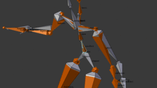
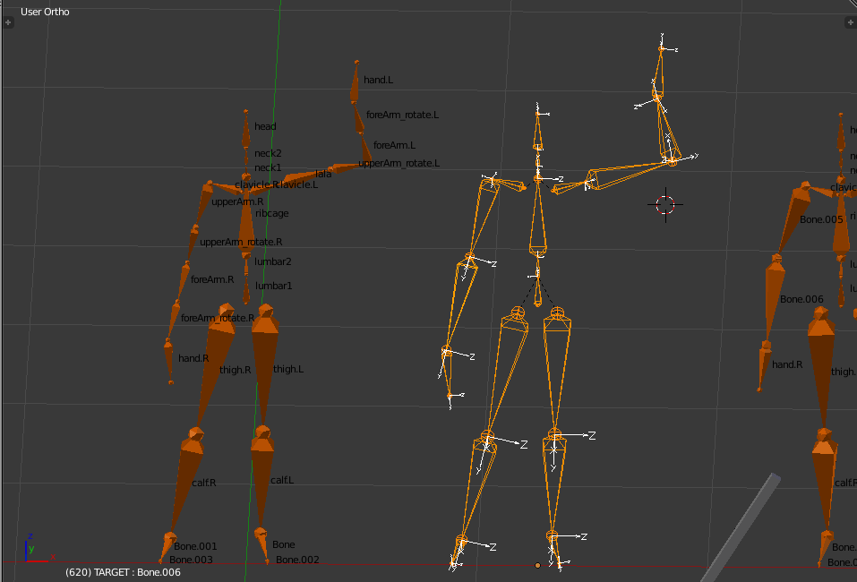
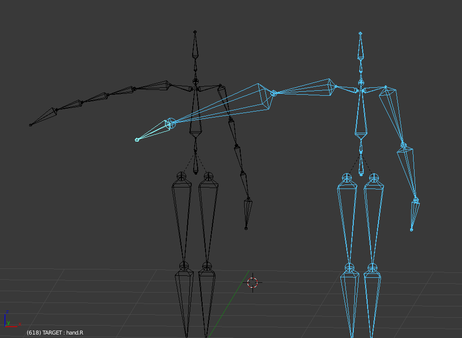
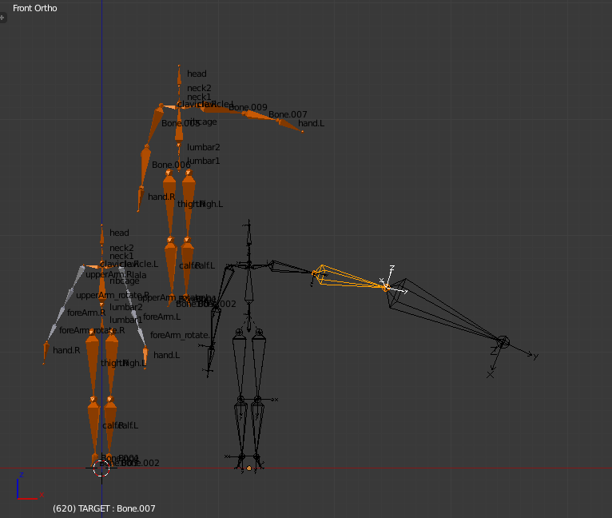
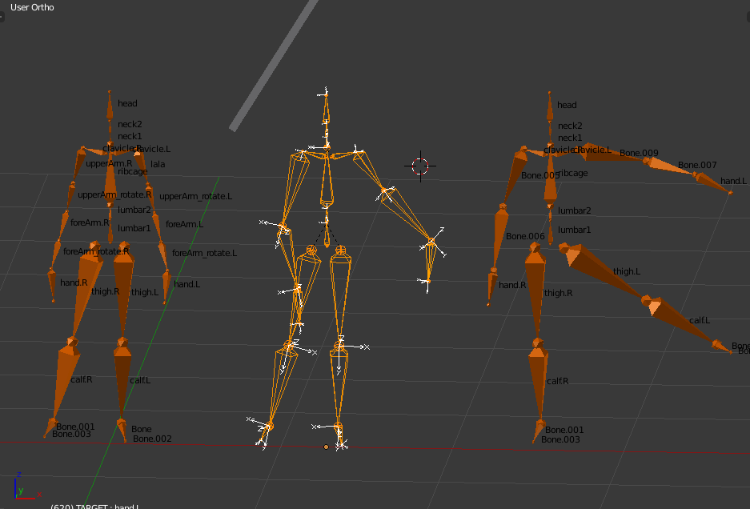

# [WIP] Converting the MCU mocap database to Blender

The idea is been able to create an arbitriary armature in blender and then run this script to convert all the animations of the database to this new base pose

## Screenshots

## Failure Screenshots :sweat_smile:

   